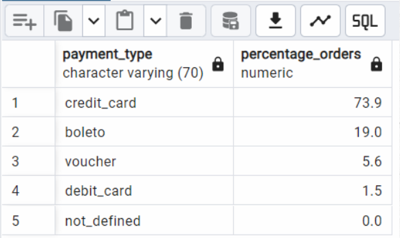

# Day_3
---


# Amazon Brazil SQL Analytics

This repository contains a collection of SQL queries used to analyze e-commerce data from Amazon Brazil. These queries aim to extract valuable business insights that can help optimize strategy, enhance customer experience, and improve operational efficiency.

---

## 📊 Problem 1: Average Payment Values by Payment Type

**Objective:**  
Analyze the average payment value for each payment method to identify which types tend to have higher payment values.

**SQL Query:**
```sql
SELECT
  payment_type,
  ROUND(AVG(payment_value)) AS rounded_avg_payment
FROM
  amazon_brazil.payments
WHERE
  payment_type IS NOT NULL AND payment_value > 0
GROUP BY
  payment_type
ORDER BY
  rounded_avg_payment ASC;
```

**🔍 Output Screenshot:**  


---

## 📈 Problem 2: Distribution of Orders by Payment Type

**Objective:**  
Calculate the percentage of total orders for each payment method to better understand customer payment preferences.

**SQL Query:**
```sql
SELECT
  payment_type,
  ROUND(COUNT(order_id) * 100.0 / 
    (SELECT COUNT(order_id) FROM amazon_brazil.payments), 1) AS percentage_orders
FROM
  amazon_brazil.payments
GROUP BY
  payment_type
ORDER BY
  percentage_orders DESC;
```

**🔍 Output Screenshot:**  


---

## 📅 Problem 3: Top 3 Months with Highest Sales

**Objective:**  
Identify seasonal patterns by determining the months with the highest total sales.

**SQL Query:**
```sql
SELECT
  TO_CHAR(o.order_purchase_timestamp, 'YYYY-MM') AS month,
  ROUND(SUM(oi.price), 0) AS total_sales
FROM
  amazon_brazil.orders o
JOIN
  amazon_brazil.order_items oi ON o.order_id = oi.order_id
GROUP BY
  month
ORDER BY
  total_sales DESC
LIMIT 3;
```

**🔍 Output Screenshot:**  


---

## 🏷️ Problem 4: Price Range & Average Price by Product Category

**Objective:**  
Understand pricing dynamics by calculating the min, max, and average price of products within each category.

**SQL Query:**
```sql
SET search_path TO amazon_brazil;

SELECT
  p.product_category_name,
  MIN(oi.price) AS min_price,
  MAX(oi.price) AS max_price,
  ROUND(AVG(oi.price), 0) AS avg_price
FROM
  product p
JOIN
  order_items oi ON p.product_id = oi.product_id
GROUP BY
  p.product_category_name
ORDER BY
  avg_price DESC;
```

**🔍 Output Screenshot:**  


---

## 💰 Problem 5: Top 5 Product Categories by Revenue

**Objective:**  
Determine which product categories generate the most revenue.

**SQL Query:**
```sql
SELECT
  pr.product_category_name,
  SUM(oi.price) AS total_revenue
FROM
  product AS pr
JOIN
  order_items AS oi ON pr.product_id = oi.product_id
JOIN
  orders AS o ON oi.order_id = o.order_id
JOIN
  payments AS pa ON o.order_id = pa.order_id
GROUP BY
  pr.product_category_name
ORDER BY
  total_revenue DESC
LIMIT 5;
```

**🔍 Output Screenshot:**  


---

## 🌦️ Problem 6: Total Sales by Season

**Objective:**  
Compare total sales between different seasons based on order purchase dates.

**Seasons Defined As:**
- **Spring:** March, April, May  
- **Summer:** June, July, August  
- **Autumn:** September, October, November  
- **Winter:** December, January, February

**SQL Query:**
```sql
SET search_path TO amazon_brazil;

SELECT
  CASE
    WHEN EXTRACT(MONTH FROM o.order_purchase_timestamp) IN (3, 4, 5) THEN 'Spring'
    WHEN EXTRACT(MONTH FROM o.order_purchase_timestamp) IN (6, 7, 8) THEN 'Summer'
    WHEN EXTRACT(MONTH FROM o.order_purchase_timestamp) IN (9, 10, 11) THEN 'Autumn'
    ELSE 'Winter'
  END AS season,
  SUM(p.payment_value) AS total_sales
FROM orders o
JOIN payments p ON o.order_id = p.order_id
GROUP BY season
ORDER BY total_sales DESC;
```

**🔍 Output Screenshot:**  


---

## 📆 Problem 7: Monthly Revenue Trends in 2018

**Objective:**  
Analyze monthly revenue patterns for the year 2018 and visualize periods of peak and low sales.

**SQL Query:**
```sql
SELECT
  TO_CHAR(o.order_purchase_timestamp, 'Mon') AS month,
  SUM(p.payment_value) AS total_revenue
FROM
  amazon_brazil.orders o
JOIN
  amazon_brazil.payments p ON o.order_id = p.order_id
GROUP BY
  month
ORDER BY
  total_revenue DESC;
```

**📊 Excel Tip:** Export results and use a line or bar chart to visualize monthly trends.

**🔍 Output Screenshot:**  


---

## 👥 Problem 8: Customer Segmentation by Purchase Frequency

**Objective:**  
Segment customers into groups based on how frequently they place orders:
- **Occasional:** 1–2 orders  
- **Regular:** 3–5 orders  
- **Loyal:** More than 5 orders

**SQL Query:**
```sql
SET search_path TO amazon_brazil;

WITH customer_order_count AS (
  SELECT customer_id, COUNT(order_id) AS order_count
  FROM orders
  GROUP BY customer_id
),
customer_segments AS (
  SELECT customer_id,
    CASE
      WHEN order_count BETWEEN 1 AND 2 THEN 'Occasional'
      WHEN order_count BETWEEN 3 AND 5 THEN 'Regular'
      WHEN order_count > 5 THEN 'Loyal'
    END AS customer_type
  FROM customer_order_count
)
SELECT
  customer_type,
  COUNT(customer_id) AS count
FROM customer_segments
GROUP BY customer_type
ORDER BY count DESC;
```

**📊 Excel Tip:** Use a pie chart to show the distribution of customer segments.

**🔍 Output Screenshot:**  


---

## 🏆 Problem 9: Top 20 High-Value Customers by Average Order Value

**Objective:**  
Identify and rank the top 20 customers based on their average order value.

**SQL Query:**
```sql
SET search_path TO amazon_brazil;

WITH CustomerOrderValue AS (
  SELECT customer_id,
         AVG(price) AS avg_order_value
  FROM Orders o
  JOIN Order_Items oi ON o.order_id = oi.order_id
  GROUP BY customer_id
)
SELECT customer_id,
       avg_order_value,
       RANK() OVER (ORDER BY avg_order_value DESC) AS customer_rank
FROM CustomerOrderValue
ORDER BY avg_order_value DESC
LIMIT 20;
```

**🔍 Output Screenshot:**  


---

## 🔁 Problem 10: Customers with Multiple Orders

**Objective:**  
Find customers who have placed more than one order and count the total orders they've made.

**SQL Query:**
```sql
SET search_path TO amazon_brazil;

SELECT
  c.customer_unique_id,
  COUNT(o.order_id) AS total_orders
FROM
  customers c
JOIN
  orders o ON c.customer_id = o.customer_id
GROUP BY
  c.customer_unique_id
HAVING
  COUNT(o.order_id) > 1
ORDER BY
  total_orders DESC;
```

**🔍 Output Screenshot:**  


---
